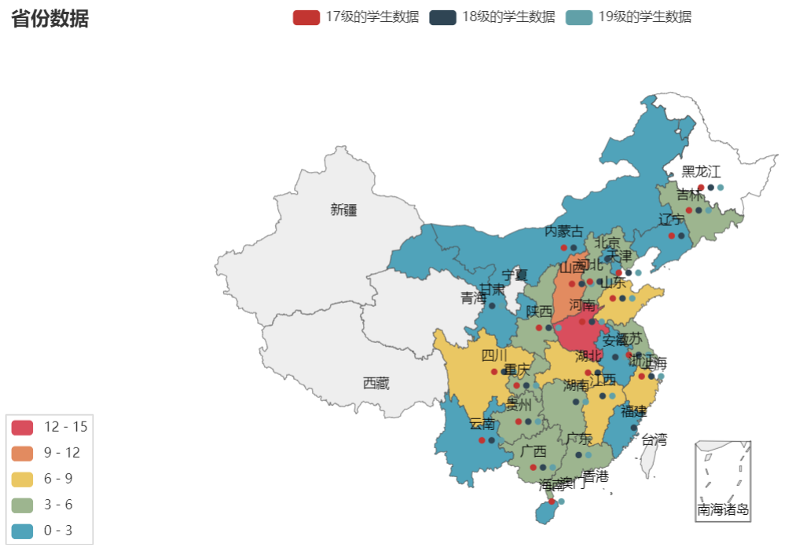
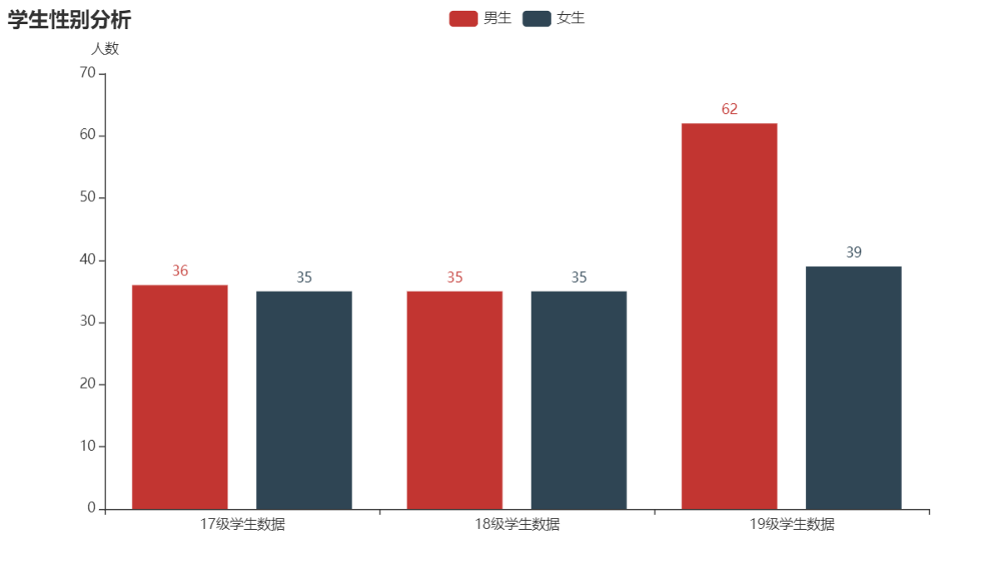
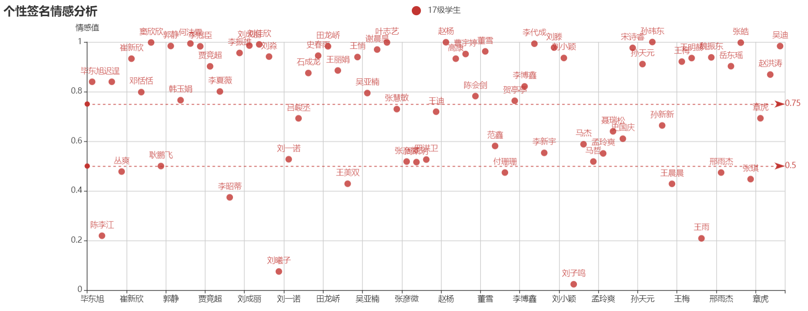

数据分析单元小结与作业
=========
# 主要用到的库及函数：

## pyechart
Python ❤️ ECharts = pyecharts

百度开源的一个数据可视化库，用于可视化数据

本章主要学习了条形图、散点图、折线图、关系图、map图、geo图的用法。

[//]: # (## numpy)

[//]: # (    NumPy是Python中科学计算的基础包。)

[//]: # (    它是一个Python库，提供多维数组对象，各种派生对象（如掩码数组和矩阵），以及用于数组快速操作的各种API，)

[//]: # (    有包括数学、逻辑、形状操作、排序、选择、输入输出、离散傅立叶变换、基本线性代数，基本统计运算和随机模拟等等。)

## pandas
Pandas 是 Python (opens new window)的核心数据分析支持库，提供了快速、灵活、明确的数据结构，旨在简单、直观地处理关系型、标记型数据。

在本章节中，我主要用它进行数据处理与数据清洗
（其实并没有用。太麻烦了，用的xlrd)
## xlrd
xlrd是读取excel表格数据；
支持 xlsx和xls 格式的excel表格；
## csv
用于读取csv文件
## conllection.Counter()
Counter函数的功能主要是计数器，特别是在对源数据是字典类型的数据进行计数时，如果不想写冗长繁琐的for循环，那么使用Counter函数将是一个不错的选择。
    
## snownlp
SnowNLP是一个python写的类库，可以方便的处理中文文本内容，
这里主要用它进行文本情感分析

--------------------------------------

# 单元作业及实现思路
 
根据上课讲的吴迪老师的微信好友数据分析，请选择你的微信好友数据，或者你的qq好友数据，或者你的班级同学数据，或者其他你能获取的其他人物数据作为分析对象。然后利用上课讲的技术，但不限于，对其进行数据分析。比如分析微信好友数据，可以可视化好友男女比例分布，可视化省份来源，可视化签名的情感强度值等等。

要求：
1.分析数据用xls或者csv格式存储。

2.代码用py文件附件形式上传，方便我的下载。

3.在作业里可以介绍你的主要功能和可视化截图。

4.根据功能完整性和结果的酷给分。

## 项目分析及功能模块
这里主要是对所学的内容进行复习。
所以主要想实现的功能有：
1. 能够读取csv、xls文件数据
2. 学生的省份（Map）、性别可视化（条形图）。
3. 学生的成绩变化可视化（折线图）
4. 个性签名分析
5. 组合图表

## 实现
### getcsvData()|getxlsData()
实现文件数据的读取和规范化，承担了数据的预处理
主要的难点在于预处理，千奇百怪的数据还是得靠人来给程序加条件处理。人工智能，人工越多越智能

### VisualPropyecharts()|VisualSexpyechart()
用于省份可视化|性别可视化

难点在于对数据选取合适的表达方式：以什么为坐标轴、数据度量的尺度、数据分类。

关键目的在于如何将数据中蕴含的信息通过图表直观的表达出来

### VisualGradepyechart()
用于将每个学生的成绩用折线图可视化

x轴为学期，y轴为名次。按照学生姓名分类

### mood()
简易分析个签情感。

调用.sentiments 处理就完事。然后用散点图进行呈现，横坐标为姓名，纵坐标为情感值，按年级做划分

万一一个人个签有两句话？ 读进来之后先处理，按句分开

### mix()
把图表组合起来

不实现了，和我的想法不一样